# Домашнее задание к занятию "Защита сети" - Tarkov Viktor


### Инструкция по выполнению домашнего задания

   1. Сделайте `fork` данного репозитория к себе в Github и переименуйте его по названию или номеру занятия, например, https://github.com/имя-вашего-репозитория/git-hw или  https://github.com/имя-вашего-репозитория/7-1-ansible-hw).
   2. Выполните клонирование данного репозитория к себе на ПК с помощью команды `git clone`.
   3. Выполните домашнее задание и заполните у себя локально этот файл README.md:
      - впишите вверху название занятия и вашу фамилию и имя
      - в каждом задании добавьте решение в требуемом виде (текст/код/скриншоты/ссылка)
      - для корректного добавления скриншотов воспользуйтесь [инструкцией "Как вставить скриншот в шаблон с решением](https://github.com/netology-code/sys-pattern-homework/blob/main/screen-instruction.md)
      - при оформлении используйте возможности языка разметки md (коротко об этом можно посмотреть в [инструкции  по MarkDown](https://github.com/netology-code/sys-pattern-homework/blob/main/md-instruction.md))
   4. После завершения работы над домашним заданием сделайте коммит (`git commit -m "comment"`) и отправьте его на Github (`git push origin`);
   5. Для проверки домашнего задания преподавателем в личном кабинете прикрепите и отправьте ссылку на решение в виде md-файла в вашем Github.
   6. Любые вопросы по выполнению заданий спрашивайте в чате учебной группы и/или в разделе “Вопросы по заданию” в личном кабинете.
   
Желаем успехов в выполнении домашнего задания!
   
### Дополнительные материалы, которые могут быть полезны для выполнения задания

1. [Руководство по оформлению Markdown файлов](https://gist.github.com/Jekins/2bf2d0638163f1294637#Code)

---

### Подготовка к выполнению заданий

   1. Подготовка защищаемой системы:

   - установите **Suricata**,
   - установите **Fail2Ban**.

   2. Подготовка системы злоумышленника: установите nmap и thc-hydra либо скачайте и установите **Kali linux**.

Обе системы должны находится в одной подсети.

*Защищаемая система - UBUNTU - 192.168.0.10*

```python
sudo apt install suricata
sudo suricata-update —no-test
# 6/9/2025 -- 10:02:47 - <Info> -- Writing rules to /var/lib/suricata/rules/suricata.rules: total: 60768; enabled: 44983; added: 60768; removed 0; modified: 0
sudo nano /etc/suricata/suricata.yaml
# EXTERNAL_NET: "any"
# af-packet:
# interface: enp0s3
# default-rule-path: /var/lib/suricata/rules
sudo systemctl restart suricata.service
sudo systemctl status suricata.service
sudo suricata -c /etc/suricata/suricata.yaml -i enp0s3
sudo tail -f /var/log/suricata/fast.log


sudo apt install fail2ban
sudo systemctl status fail2ban
```

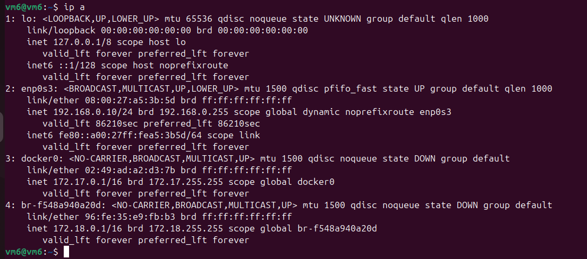
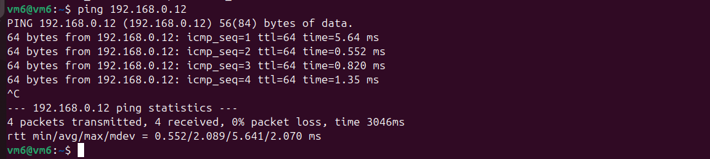

*Система злоумышленника - KALI LINUX - 192.168.0.12*

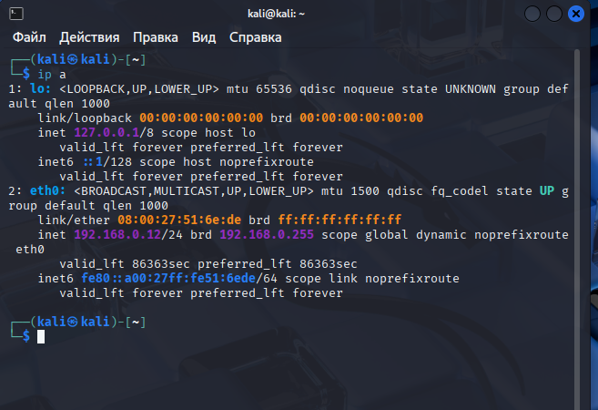

---

### Задание 1

Проведите разведку системы и определите, какие сетевые службы запущены на защищаемой системе:

**sudo nmap -sA < ip-адрес >**

**sudo nmap -sT < ip-адрес >**

**sudo nmap -sS < ip-адрес >**

**sudo nmap -sV < ip-адрес >**

По желанию можете поэкспериментировать с опциями: https://nmap.org/man/ru/man-briefoptions.html.

В качестве ответа пришлите события, которые попали в логи Suricata и Fail2Ban, прокомментируйте результат.

*sudo nmap -sA 192.168.0.10*

Suricata никак не отриагировала на сканирование.

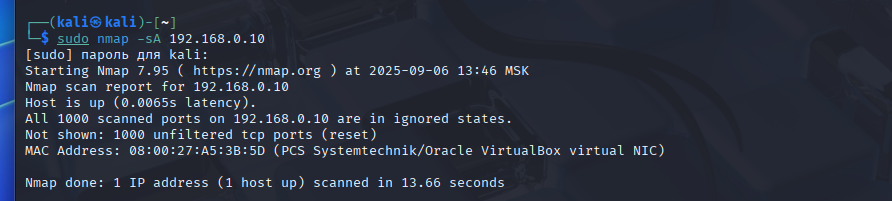

*sudo nmap -sT 192.168.0.10*

Suricata отражает опасный трафик на порты 3306 MySQL, 1521 Oracle SQL, 1433 MSSQL, 5432 PostgeSQL. Помимо этого наблюдается сканирование VNC 5800-5820 как "Попытка утечки информации".

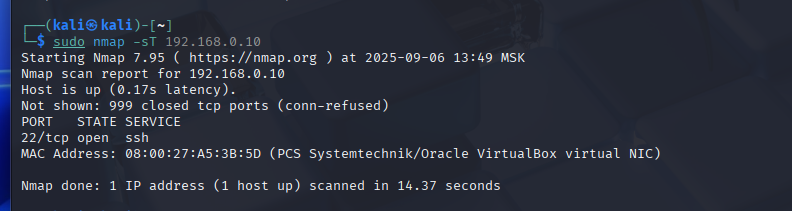
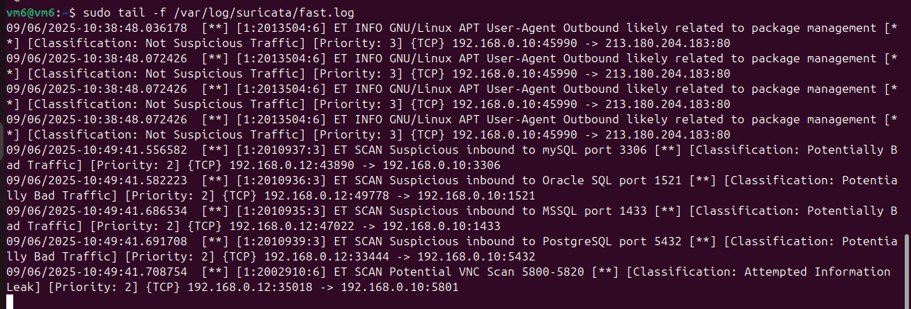

*sudo nmap -sS 192.168.0.10*

Suricata отражает опасный трафик на те же порты, что и при сканировании -sT, при этом порт системы злоумышленника и порт защищаемой системы при сканировании VNC 5800-5820 изменился.

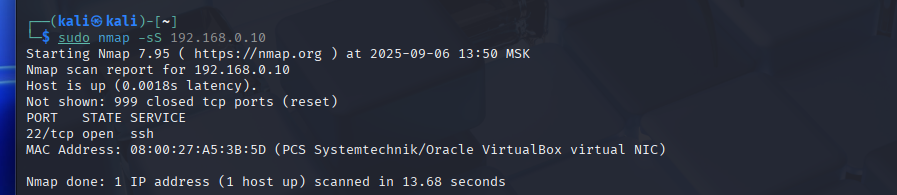
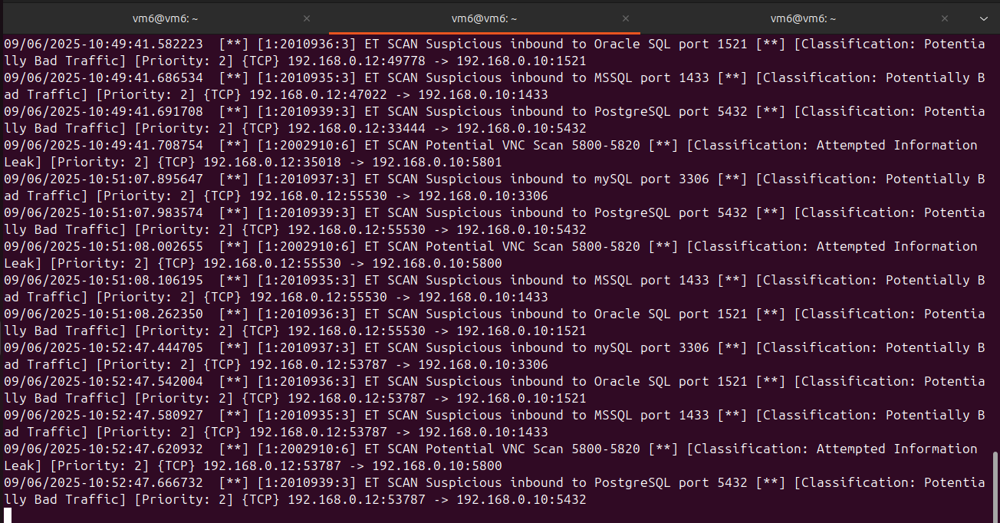

*sudo nmap -sV 192.168.0.10*

Suricata отражает опасный входящий трафик.

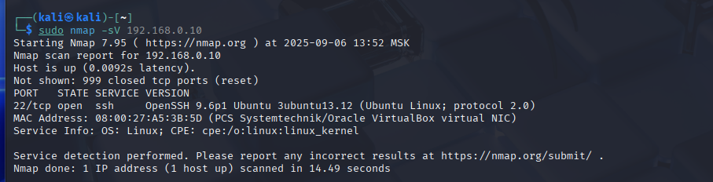
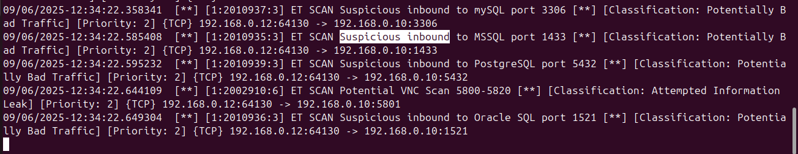

*Fail2Ban* во время сканирования никак не отреагировал ни на одну из команд.

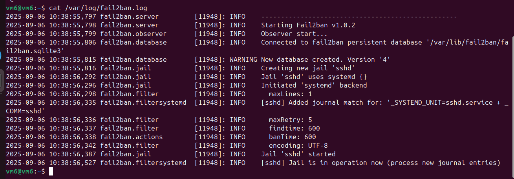

---

### Задание 2

Проведите атаку на подбор пароля для службы SSH:

**hydra -L users.txt -P pass.txt < ip-адрес > ssh**

   1. Настройка **hydra**:

   - создайте два файла: users.txt и pass.txt;
   - в каждой строчке первого файла должны быть имена пользователей, второго — пароли. В нашем случае это могут быть случайные строки, но ради эксперимента можете добавить имя и пароль существующего пользователя.

Дополнительная информация по hydra: https://kali.tools/?p=1847.

   2. Включение защиты SSH для Fail2Ban:

   - открыть файл /etc/fail2ban/jail.conf,
   - найти секцию **ssh**,
   - установить **enabled** в **true**.

Дополнительная информация по Fail2Ban:https://putty.org.ru/articles/fail2ban-ssh.html.

В качестве ответа пришлите события, которые попали в логи Suricata и Fail2Ban, прокомментируйте результат.

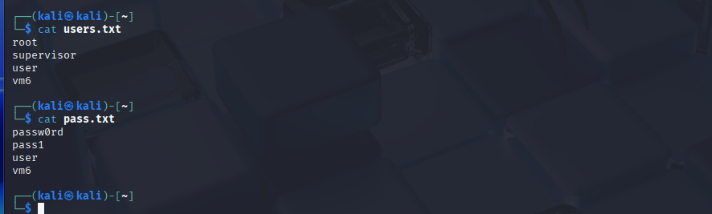
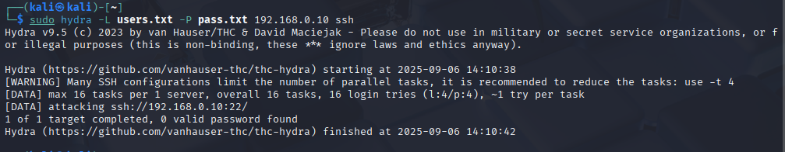

Suricata обнаружила подозрительный трафик, а Fail2Ban реагирует на подбор пароля и блокирует хост.  

**Suricata:**

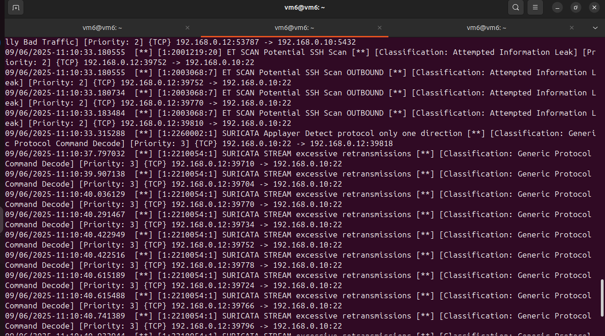

**Fail2Ban:**

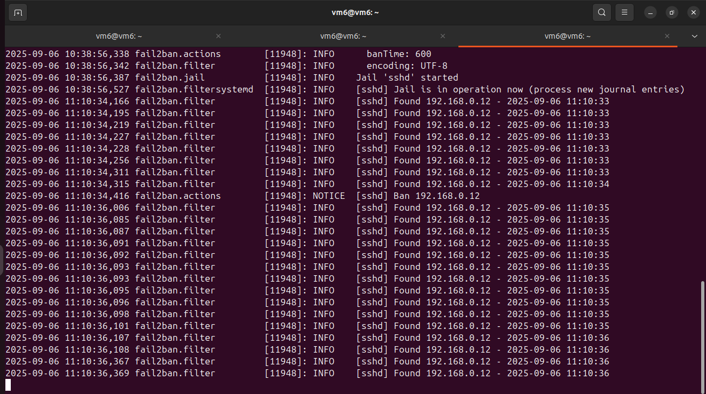


Включение защиты SSH для Fail2Ban

```python
sudo nano /etc/fail2ban/jail.conf
enabled = true
```

Повторная аката - в соединении отказано

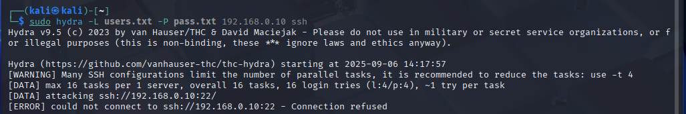

---


